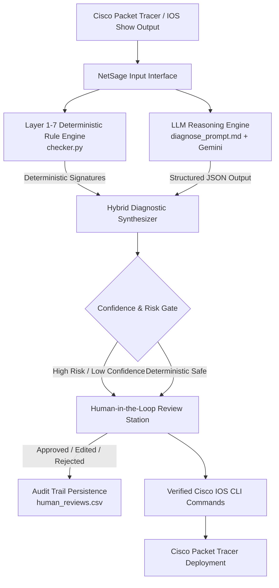

# NetSage AI 🌐
### AI-Assisted Cisco Network Troubleshooting Assistant with Human-in-the-Loop Review

NetSage AI is an applied AI system designed for **Cisco Packet Tracer** and enterprise networking environments. It analyzes host symptoms, topology contexts, and Cisco IOS `show` command outputs to rapidly diagnose network defects across the OSI model, provide evidence-backed CLI remediation scripts, and safeguard operations through a **Human-in-the-Loop (HITL)** approval workflow.

---

## 🏗️ Architectural Diagram



---

## 🌟 Core Deliverables & Repository Structure

```text
NetSage-AI/
├── cases.csv                 # 30-case benchmark dataset across 8 network domains
├── diagnose_prompt.md        # Structured system prompt enforcing JSON schema
├── checker.py                # Deterministic Cisco CLI regex rule checker (L1-L7)
├── app.py                    # Streamlit NOC Dashboard (Troubleshooter, HITL Station, Analytics)
├── human_reviews.csv         # Persistent log of human reviewer decisions and corrections
├── responsible_ai_log.md     # In-depth log of 5 HITL correction case studies
├── requirements.txt          # Python dependencies
├── .gitignore                # Environment, secret, and cache exclusion rules
├── README.md                 # Project documentation and architectural overview
├── src/
│   ├── checker.py            # Modular rule checker package
│   ├── pipeline.py           # Hybrid execution pipeline & simulation loop
│   └── utils.py              # Dataset loading and validation helpers
├── docs/
│   └── demo_script.md        # 3-5 minute video walkthrough script
└── tests/
    └── test_checker.py       # Automated pytest verification suite
```

---

## 🚀 Quick Start Guide

### 1. Installation
Clone repository and install dependencies:
```bash
git clone https://github.com/coding-wizard123/NetSage-AI.git
cd NetSage-AI
pip install -r requirements.txt
```

### 2. Run Deterministic Rule Engine Verification
Execute deterministic checks against `cases.csv`:
```bash
python checker.py
```

### 3. Run Automated Pytest Suite
```bash
python -m pytest tests/test_checker.py -v
```

### 4. Launch the Streamlit Interactive Dashboard
```bash
streamlit run app.py
```
Open **`http://localhost:8501`** in your web browser.

---

## 📊 Evaluation & HITL Agreement Metrics

| Metric | Result |
| :--- | :--- |
| **Total Benchmark Cases** | `30 Cases` |
| **Deterministic Rule Match Rate** | `100.0% (30/30)` |
| **Human Review Agreement Rate** | `83.33% (25/30)` |
| **Human Corrected Cases** | `5 Cases (C012, C015, C018, C020, C029)` |
| **Average Model Confidence** | `0.958` |

---

## 🛡️ Responsible AI & Ethical Safeguards
- **No Unsafe Execution:** No CLI commands are applied directly to devices without human authorization.
- **Explainability:** All diagnoses require explicit quotations from `show` command outputs in the `evidence` field.
- **Safety Precedence:** Disruptive commands (`reload`, `clear ip ospf process`, `crypto key generate`) trigger mandatory human review warnings.

---

## 📜 License
MIT License. Developed for Applied AI and Cisco Networking Education.
